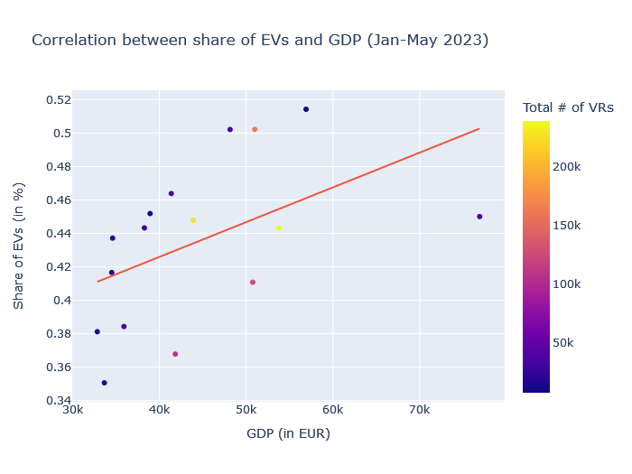

# AMSE/SAKI 2023 Project

## Overview

- The project report can be found either as
	- [Notebook](./project/report.ipynb) (Visualization not working in GitHub)
	- [Github Pages](https://luccalb.github.io/2023-amse-template/) (prefrerred)
- The data exploration is performed in [Data Exploration Notebook](./project/exploration.ipynb)
- The initial project plan can be found at [/project/project-plan.md](./project/project-plan.md)

## Introduction

### Research question
__"Do german federal states with a higher GDP also have a higher share of electric/hybrid vehicles registered?"__

### Description

The leading question for this data analysis is wether there exists a correlation between the GDP of german federal states and the share of electric/hybrid vehicles among all newly registered cars. To answer this question, data is collected from two public data sources. This data is then transformed and combined for the final analysis. For further details, please see the initial [project plan](./project/project-plan.md).

### Datasets

- Vehicle Registrations
  - Source: Kraftfahrtbundesamt
  - Link: https://www.kba.de/DE/Statistik/Produktkatalog/produkte/Fahrzeuge/fz8/fz8_gentab.html
  - Details: If new monthly reports are published they will be automatically included in the final analysis
- GDP by federal state
  - Source: Statistisches Bundesamt
  - Link: https://www.statistikportal.de/de/vgrdl/ergebnisse-laenderebene/bruttoinlandsprodukt-bruttowertschoepfung#alle-ergebnisse
  - Details: Most recent available data is from 2022

## Result

Please see the detailed [report](https://luccalb.github.io/2023-amse-template/) for an interactive version of the plot.

